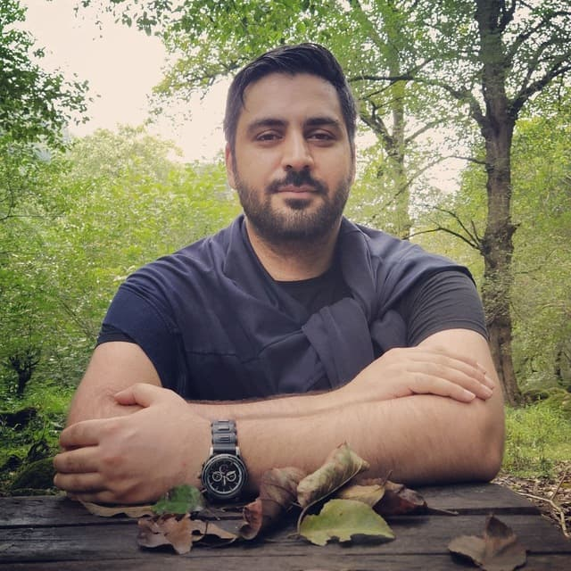

  

<b style="color:rgb(135,135,235);">About Me: </b> Welcome to my personal website! 
I am a highly motivated and versatile researcher currently pursuing my PhD at the Tilburg University's Methodology and Statistics department. 
with the aim of identifying key social science phenomena and deriving testable hypotheses. By integrating advanced NLP algorithms and Gatph Neural Networks methods, I aim to unlock new insights and contribute to the advancement of social science research. My work reflects a strong commitment to innovation, as I seek to deliver groundbreaking results that have the potential to revolutionize the field.
I am also passionate about web application design, particularly using JavaScript, React, and Node.js to build intuitive interfaces for AI systems. With a commitment to innovation and continuous learning, I am dedicated to delivering impactful results that push the boundaries of what is possible.
Me in a nutshell: Book addict  
currently, I am engrossed in these two books:
- [Speech and Language Processing](https://www.amazon.com/Speech-Language-Processing-Daniel-Jurafsky/dp/0131873210)
- [Natural Language Processing with PyTorch](https://www.amazon.com/Natural-Language-Processing-PyTorch-Applications/dp/1491978236/ref=pd_sbs_18/145-9588523-3399417?pd_rd_w=iaFuT&pf_rd_p=180628c6-6f13-4dbf-9213-f09cdedc7815&pf_rd_r=RQ1PJAF52HZ2HHHHV986&pd_rd_r=6db67402-d2d9-4145-94b8-ea82f5fd237b&pd_rd_wg=UCVxD&pd_rd_i=1491978236&psc=1)

Interests: Natural Language Processing, Recommender systems, Developing react web applications Powered by AI

My tools and lovely friends: python, javascript, react, numpy, sklearn, Pytorch, Keras, flask, Node.js
