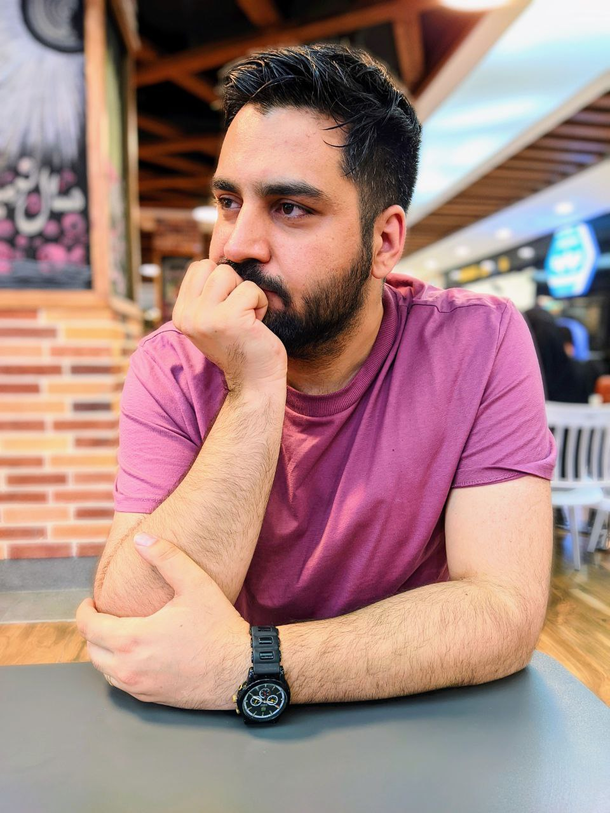

  

<b style="color:rgb(135,135,235);"> About Me:</b> I am an enthusiastic researcher who is currently working towards my PhD at Tilburg University's Methodology and Statistics department. I have the privilege of being supervised by [dr.Caspar J. van Lissa](https://cjvanlissa.github.io/resume/), [dr. Bennett Kleinberg](https://bkleinberg.net/), and [Professor Jeroen Vermunt](https://research.tilburguniversity.edu/en/persons/jeroen-vermunt).  I work on theory development and refinement in the social sciences, utilizing natural language processing methods. My approach combines large language models for data extraction with graph neural networks for data analysis.

Interests: Natural Language Processing, Recommender systems, Developing react web applications Powered by AI

My tools and lovely friends: python, javascript, react, numpy, sklearn, Pytorch, Keras, flask, Node.js

Contact:
r.norouzinikjeh@tilburguniversity.edu

[google scholar](https://scholar.google.com/citations?user=syJhsDMAAAAJ&hl=en&oi=ao)

[ORCID](https://orcid.org/0000-0002-4447-764X)

---

## Recent Activities

- **[Publication]** "Capturing Causal Claims: A Fine-tuned Text Mining Model for Extracting Causal Sentences from Social Science Papers" published in *Research Synthesis Methods* *(2025)*
- **[Talk]** Presented at the *European Conference on Research Methods* – "Using LLMs for Theory Extraction in Social Sciences" *(June 2025)*
- **[Workshop]** Organized a hands-on workshop on *Graph Neural Networks for Social Science Research* at Tilburg University *(April 2025)*

➡️ [See all news and activities](/news)
