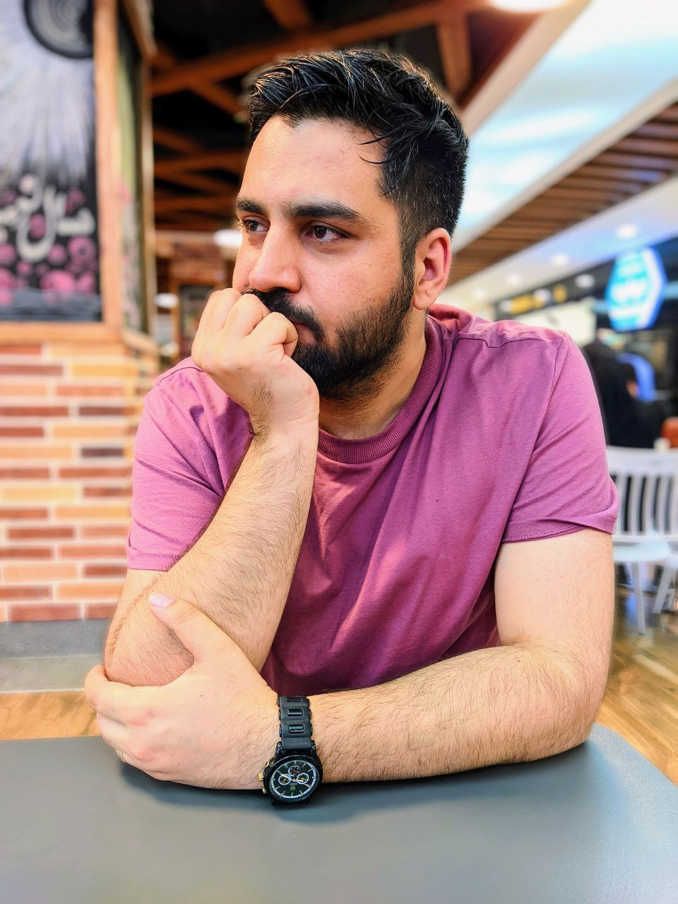

  

<b style="color:rgb(247, 22, 105);">About Me: </b> I work on the text datasets and documents clustering, But inside me, there is a mysterious connection to the math behind the machine learning algorithms. Curiosity pushed me to learner algorithms and AI world, and as I found my passion about it, I have been trying to know how they work and how they will be better.

Interests: Natural Language Processing, Recommender systems, Developing react web applications Powered by AI

My tools and lovely friends: python, javascript, react, numpy, sklearn, Pytorch, Keras, flask
